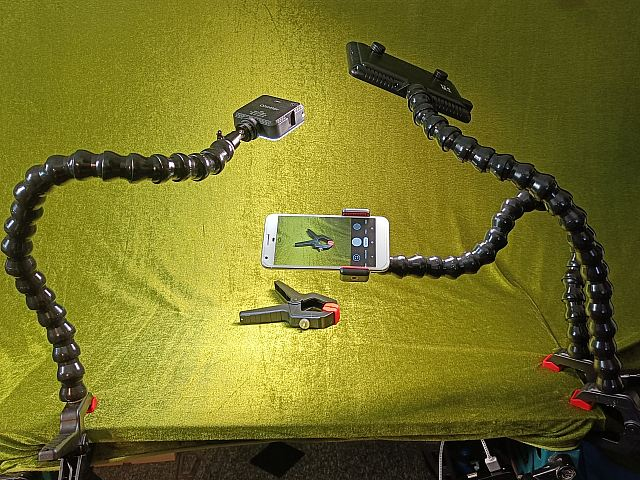

Maker Media GmbH

***

# Flexible Stative im Eigenbau

### **Egal ob für Licht, Kamera oder als dritte Hand: Diese Stative sind vielseitig einsetzbar und kommen überall hin, auch um die Ecke.**

 

Den vollständigen Artikel gibt es in der [Make-Ausgabe 1/22 ab Seite 68](https://www.heise.de/select/make/2022/1/seite-68).

Im Ordner CAD finden Sie die 3D-Dateien in verschiedenen Formaten.

